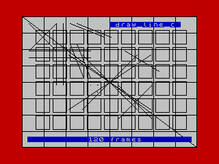
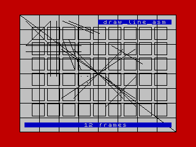
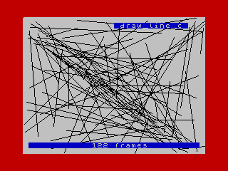
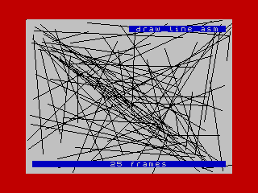

Bresenham's Line Drawing Algorithm for the ZX Spectrum 48K/128K in Z80 Assembler (with C version for comparison).

This is highly optimized for drawing horizontal and vertical lines using the specifics of how the ZX Spectrum Screen Memory is laid out.

z88dk is used as the wrapper to call the C and ASM versions and generate .SNA and .TAP snapshot files for use in the DeZog Debugger for Visual Studio Code, or any ZX Spectrum emulator.

This uses the "new" libraries with the SDCC IY compiler and library. 

## Results

These screenshots show the performance comparison of the accuracy tests:

|  |  |

Here is a set of random lines (same set each run):

|  |  |